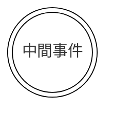
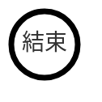
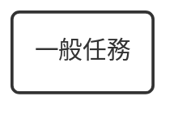
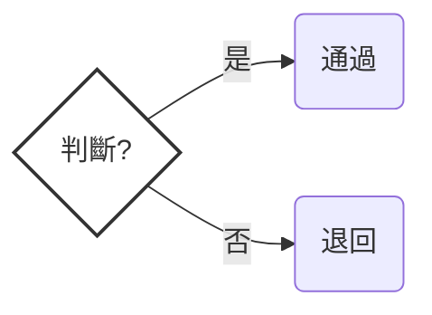
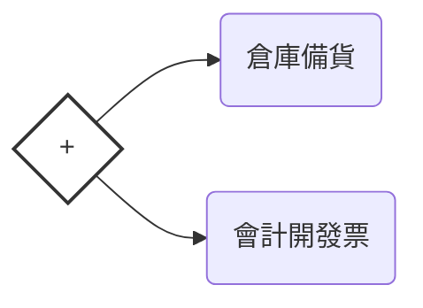
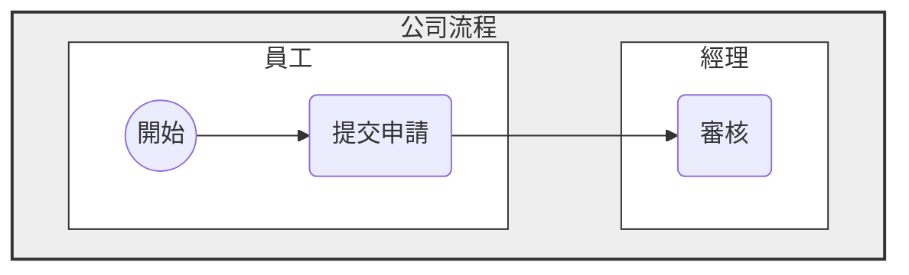

# BPMN.io 符號圖解指南 (Cheat Sheet)

這份指南是專為 BPMN.io 使用者設計的快速參照表。BPMN (Business Process Model and Notation) 是國際通用的流程圖標準。

## 1. 事件 (Events) - 圓形

口訣：細線開始、粗線結束、雙圈中間。
事件代表「發生了某件事」，而不是「做某件事」。

### 開始事件 (Start Event)

圖示外觀：細線圓圈。

意義：流程的起點。

範例：收到訂單、每週一早上 9 點。

### 中間事件 (Intermediate Event)

圖示外觀：雙線圓圈（雙圈）。

意義：流程進行中發生的事，通常代表「等待」或「收到通知」。

範例：等待顧客付款、收到確認信。

### 結束事件 (End Event)

圖示外觀：粗線圓圈（BPMN.io 中預設為黑色加粗邊框）。

意義：流程的終點。

範例：訂單完成、結案。

## 2. 活動 (Activities) - 圓角矩形

這是流程圖的主角，代表「誰做了什麼動作」。

### 🟦 任務 (Task) / 一般任務

圖示外觀：空白的圓角矩形。

意義：最基本的動作。

範例：撰寫報告、打包商品。

### 👤 使用者任務 (User Task)

圖示外觀：左上角有「小人」圖示。

意義：需要人在電腦系統上操作的任務。

操作：在 BPMN.io 點擊任務 → 按板手 (Change type) → 選 User Task。

範例：員工登入系統審核、會計輸入金額。

### ⚙️ 服務任務 (Service Task)

圖示外觀：左上角有「齒輪」圖示。

意義：系統自動執行的任務（人不需要介入）。

操作：在 BPMN.io 點擊任務 → 按板手 → 選 Service Task。

範例：系統自動寄出 Email、系統計算總價。

## 3. 閘道器 (Gateways) - 菱形

流程的分岔路口，用來做決定。

### ❌ 互斥閘道 (Exclusive Gateway / XOR)

圖示外觀：空心菱形，或內部有 X。

意義：單選題（只能走一條路）。

範例：審核通過？(是 → 往下走 / 否 → 退回)。

### ➕ 平行閘道 (Parallel Gateway / AND)

圖示外觀：內部有一個加號 (+) 的菱形。

意義：分頭進行（所有路徑同時開始）。

範例：訂單成立後，倉庫去備貨 並且 會計去開發票（兩邊同時做）。

## 4. 泳道 (Pools & Lanes)

用來區分「是誰負責做這件事」。

- **池 (Pool)**：代表一個完整的組織（例如：公司、供應商）。
- **道 (Lane)**：代表組織內的部門或角色（例如：財務部、經理）。

## 5. 連接線 (Flows)

把圖形串起來的線條。

- **➡️ 順序流 (Sequence Flow)**：實線箭頭。代表步驟的先後順序。
- **⇢ 訊息流 (Message Flow)**：虛線箭頭（尾端圓圈、頭是空心）。只能用在兩個不同的 Pool 之間，代表溝通（例如：客戶發信給公司）。

## BPMN.io 操作小撇步

- **更換圖示類型**：畫出一個基本圖形後，點擊它，選擇旁邊的 板手圖示 (🔧) 即可更換成特定的任務或事件類型。
- **輸入文字**：直接雙擊任何圖形，即可輸入中文。
- **刪除**：點擊圖形後按鍵盤 Delete 或點擊 垃圾桶圖示 (🗑️)。